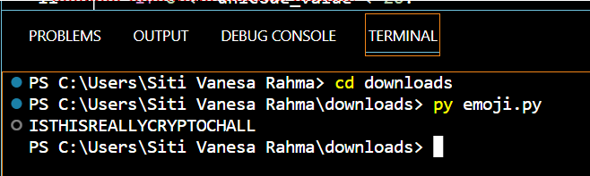

## Emoji

Pada challenge ini didapatkan tugas untuk mendecryptkan emoji dengan diberikan dua file yaitu source code dan encrypted text

> Karena diberikan source code dan teks enkripsinya, maka tinggal dilakukan dekripsi dengan kode sebagai berikut.

```
emoji = "😈 😒 😓 😇 😈 😒 😑 😄 😀 😋 😋 😘 😂 😑 😘 😏 😓 😎 😂 😇 😀 😋 😋"
	
no_space = ""
for e in emoji:
	   if e != ' ':
	       no_space += e
	       
result = ""
for item in no_space:
	   unicode_value = ord(item) - 0x1F600
	   if 0 <= unicode_value < 26:
	       result += chr(unicode_value + ord('A'))
	   else:
	       result += item
	
print(result)

```

Hasil decrypte message sebagai berikut.



Pada soal di sebutkan bahwa format flagnya adalah Format Flag: 
> ForestyHC{DECRYPTEDMESSAGE}

Maka flagnya menjadi
> ForestyHC{ISTHISREALLYCRYPTOCHALL}