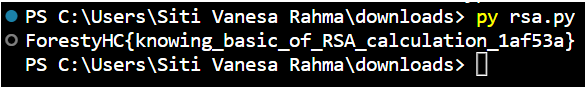

## RSA

Pada challenge RSA ini, terdapat suatu text yang diberikan berupa output.txt  yang berisi komponen yang biasa digunakan dalam rumus RSA.

Karena telah diberikan hasil pemfaktoran public key nya berupa p dan q, maka dapat langsung diselesaikan dengan cara sebagai berikut.

```
def gcd(a, b):
    while b != 0:
        a, b = b, a % b
    return a

def extended_gcd(a, b):
    if a == 0:
        return b, 0, 1
    else:
        gcd, x, y = extended_gcd(b % a, a)
        return gcd, y - (b // a) * x, x

def mod_inverse(a, m):
    gcd, x, _ = extended_gcd(a, m)
    if gcd == 1:
        return x % m

def rsa_decrypt(ciphertext, p, q, e):
    n = p * q
    phi = (p - 1) * (q - 1)
    d = mod_inverse(e, phi)
    plaintext = pow(ciphertext, d, n)
    return plaintext
```

```
ciphertext = 101745219595200349523152631186972604387562687070424337391827653334680968467499417833947662984712440742528056447473955784742413027053684762025541828629380347762172127149025219273226750365996684215327960258305658612699878870293797722424415286951422307953692960206756965270631710865360680064948856718463863745817
p = 11413103675822664225601999175273072687551879297253185126741523466362348133163394972217556084104081538105360708095307491348550738865387355072980811703266547
q = 11089095371802438499176119643627720647177193543467395911849539384700825069786241084525126707796608170135955564588268686907917715301698989138966940541549471
e = 65537

plaintext = rsa_decrypt(ciphertext, p, q, e)
result = bytearray.fromhex(hex(plaintext)[2:])
print(result.decode())
```

Hasil yang didapatkan sebagai berikut.



Sehingga, flagnya adalah:
> ForestyHC{knowing_basic_of_RSA_calculation_1af53a}
